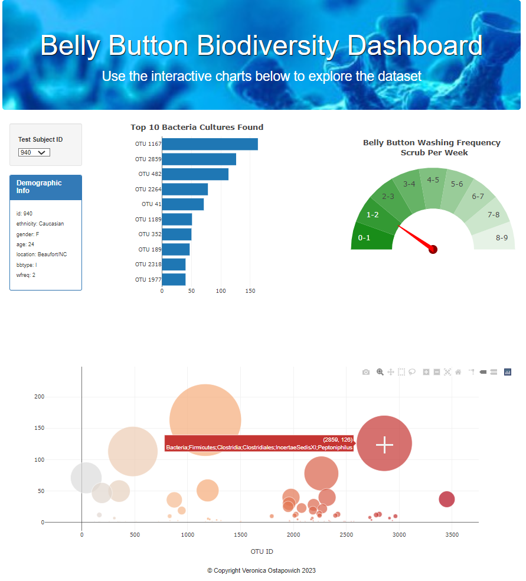

# Plot.ly Project - Belly Button Biodiversity Dashboard

## Background

In this assignment, I built an interactive dashboard to explore the [Belly Button Biodiversity](http://robdunnlab.com/projects/belly-button-biodiversity/) in my Github Pages, which catalogs the microbes that colonize human navels.

The results are given by **Subject ID** and the dataset reveals that a small handful of microbial species (also called operational taxonomic units, or **OTUs**, in the study) were present in more than 70% of people, while the rest were relatively rare.

## Instructions

### Step 1: Plotly Bar Chart

Use the D3 library to read in data/samples.json
Create a horizontal bar chart with a dropdown menu to display the top 10 OTUs found in that individual.
Use sample_values as the values for the bar chart.
Use otu_ids as the labels for the bar chart.
Use otu_labels as the hovertext for the chart.

### Step 2: Plotly Bubble Chart

Create a bubble chart that displays each sample.
Use otu_ids for the x values.
Use sample_values for the y values.
Use sample_values for the marker size.
Use otu_ids for the marker colors.
Use otu_labels for the text values.
   

### Step 3: Interactive Visualizations
    
Display the sample metadata, i.e., an individual's demographic information.
Display each key-value pair from the metadata JSON object somewhere on the page.
Update all of the plots any time that a new sample is selected.

### Step 4: Advanced Assignment (Optional)

The following task was advanced, challenging and fun.
I adapted the Gauge Chart from https://plot.ly/javascript/gauge-charts/ to plot the weekly washing frequency of the individual.
Then, I modified the example gauge code to account for values ranging from 0 through 9.
Updated the chart whenever a new sample is selected.

## Deployment

Deploy my app to a free static page hosting service, using python -m http.server

## Tools and sources

Plot.ly, Javascript, HTML, D3.js, JSON
GitHub and GitHub Pages
console.log
Refered to the Plotly.js documentation when building my plots.
Refered to other key sources such as a customizable D3 gauge

## References

Hulcr, J. et al. (2012) A Jungle in There: Bacteria in Belly Buttons are Highly Diverse, but Predictable. 
Retrieved from: http://robdunnlab.com/projects/belly-button-biodiversity/results-and-data/ 

